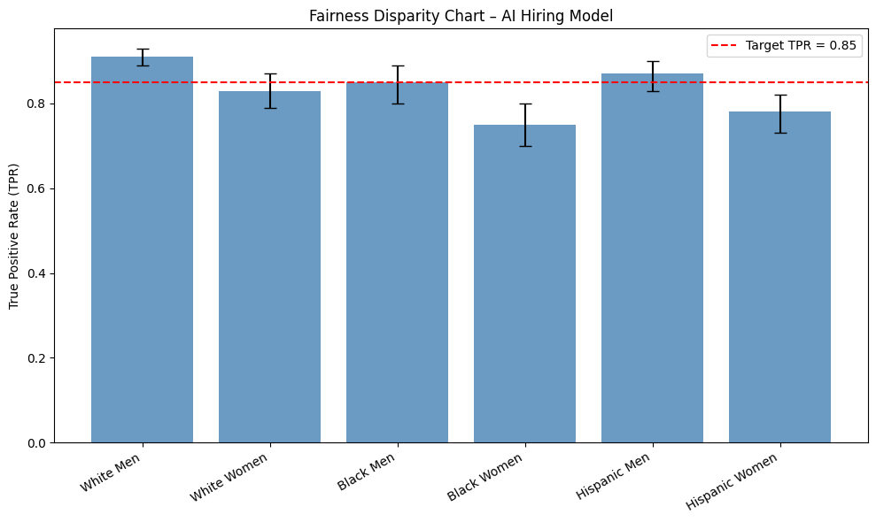
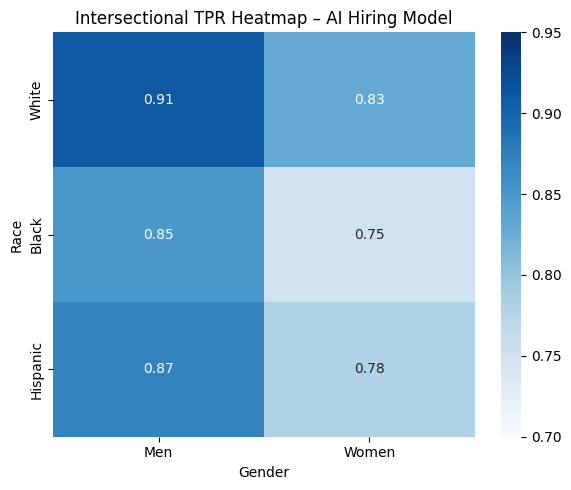

# **Case Study: Fairness Audit for an AI Hiring Platform**

This notebook walks through a complete fairness audit using the **Four-Component Framework**:

1. [Historical Context Assessment (HCA)](./1-historical-context-assessment.md)
2. [Fairness Definition Selection (FDS)](./2-fairness-definition-selection.md)
3. [Bias Source Identification (BSI)](./3-bias-source-identification.md)
4. [Comprehensive Fairness Metrics (CFM)](./4-comprehensive-fairness-metrics.md)

We’ll study an **AI hiring platform** that automatically screens software engineer candidates.

## **Phase I: Historical Context Assessment (HCA)**

### **Domain & Application Context**

* **Domain:** Hiring / HR technology (resume screening for software engineering roles).
* **Product feature:** Model shortlists applicants for interviews by scoring resumes.
* **Directly affected:** Job applicants (especially entry-level and mid-career).
* **Indirectly affected:** HR staff (workload changes), company diversity teams, regulators, advocacy groups.

**Historical harms identified:**

* **Gender bias in hiring:** Underrepresentation of women in technical roles since the 1980s; evidence of bias in performance reviews and promotion data.
* **Racial bias in referrals:** Referral-heavy hiring pipelines favor white and affluent candidates.
* **Prestige filtering:** Overweighting of elite universities has historically excluded talented low-income or first-generation candidates.
* **Intersectional harms:** Women of color are least likely to be referred or promoted and are sparsely represented in our dataset.

**Evidence collected:**

* EEOC reports on tech workforce demographics (2015–2022)
* Academic research on gender and racial bias in performance reviews
* Public datasets on university access and socioeconomic status
* Internal HR notes on hiring practices pre-2018

### **Data & Representation Analysis**

**Data sources:**

| Source              | Collected by             | Period    | Notes                                          |
| ------------------- | ------------------------ | --------- | ---------------------------------------------- |
| Resume database     | Internal recruiting team | 2014–2023 | Skewed toward referrals                        |
| Interview ratings   | Hiring managers          | 2016–2023 | Potential manager bias                         |
| Performance reviews | Line managers            | 2017–2023 | Qualitative → numeric conversion may distort   |

**Proxies identified:**

* **ZIP code → race / class** (historic segregation patterns).
* **University prestige → parental income / social class privilege.**
* **Job title (e.g., “assistant” vs. “lead”) → gendered career progression.**

**Data deserts (underrepresented groups):**

* Women in senior engineering roles
* Black and Hispanic graduates of non-elite universities
* Self-taught or bootcamp-trained developers, especially over age 35
* Intersectional: older Black women in technical roles almost absent

**Encoding review:**

* Categorical features like race, gender → stored as one-hot; missing data treated as “unknown,” potentially collapsing distinct cases.
  * Treating all missing data as a single “unknown” group hides differences — e.g., a person who refuses to state their gender vs. someone whose gender wasn’t recorded are both lumped together.
* Income brackets → coarse (only 3 bins), likely to obscure important variation.
  * People making $42k and $78k are treated as “the same” even though their situations differ a lot.
* Text embeddings for job history may not capture non-traditional paths well.
  * If someone has a non-traditional career path (e.g., career break for caregiving, freelance work, military service), the embedding may not represent them accurately. As these embeddings are often trained on large text datasets where “standard” job paths dominate.

### **Technology Transition & Feedback Loops**

**Previous system:** Manual resume screening by recruiters with ad hoc scoring.
**Current system:** ML model ranks resumes based on past “successful hire” profiles.
**Feedback risk:**

* If the model favors Ivy League resumes → more Ivy League hires → future data more skewed.
* If women or minority candidates are under-interviewed → less performance data → future models less accurate for these groups.

### **Risk Classification Matrix**

| Pattern                                              | S | L | R | Score | Rationale                                                         |
| ---------------------------------------------------- | - | - | - | ----- | ----------------------------------------------------------------- |
| ZIP code as proxy for race/class                     | 3 | 3 | 3 | 9 🔴  | Historical segregation; used in ranking features                  |
| Biased manager ratings (interview/performance)       | 3 | 2 | 3 | 8 🔴  | Labels reflect historical bias                                    |
| University prestige bias                             | 2 | 3 | 2 | 7 🟠  | Model overweights elite schools, limits socioeconomic diversity   |
| Sparse data for women in senior roles                | 3 | 2 | 2 | 7 🟠  | Few examples → model may underpredict suitability of senior women |
| Sparse data for Black/Hispanic non-elite grads       | 2 | 2 | 2 | 6 🟠  | Underrepresented in dataset → risk of exclusion                   |
| Sparse data for self-taught/bootcamp over 35         | 2 | 2 | 2 | 6 🟠  | Limited data → model may misclassify or ignore applicants         |
| Sparse data for older Black women in technical roles | 3 | 3 | 3 | 9 🔴  | Intersectional group almost absent → systemic underprediction     |
| Job title as gendered proxy                          | 2 | 2 | 2 | 6 🟠  | Career progression differences encoded in titles                  |
| Background checks missing socioeconomic info         | 1 | 2 | 2 | 5 🟡  | Could obscure context for disadvantaged applicants                |

### **Executive Summary**

> **Summary:** The hiring dataset reflects historical inequities: women, Black and Hispanic graduates from non-elite universities, self-taught or bootcamp-trained developers over 35, and older Black women are underrepresented. Features such as ZIP code, university, and job titles encode race, gender, and class indirectly. Without mitigation, the AI screener could **amplify these biases**, favoring elite, referral-based candidates and suppressing intersectional talent.
>
> **Top risks:**
>
> 1. ZIP code proxy → systemic exclusion (Score 9 🔴)
> 2. Sparse data for older Black women → intersectional underprediction (Score 9 🔴)
> 3. Biased manager ratings → codified discrimination (Score 8 🔴)
> 4. Overweighting elite universities → socioeconomic filtering (Score 7 🟠)
>
> These are the priority for now, other medium and low risks will be targeted in next phases.

## **Phase II: Fairness Definition Selection (FDS)** 

### **Strategic Questions**
> ⚠️ Answers to these questions **form the rationale** for metric selection.

Before selecting metrics, we answer these **strategic questions**:

1. **Primary Business Goal**

   * Ensure qualified candidates from all backgrounds are considered fairly.
   * Focus on entry- and mid-level software engineering applicants.

2. **Legal & Compliance Requirements**

   * Comply with equal employment opportunity laws (EEOC, anti-discrimination).
   * Maintain defensibility of hiring decisions.

3. **Stakeholder Priorities**

   * **Applicants:** Fair chance and consistent evaluation.
   * **Recruiters:** Efficiently surface qualified candidates.
   * **Leadership:** Increase diversity without compromising quality.
   * **Legal/Compliance:** Transparent and documented process.

4. **Trade-Off Considerations**

   * Accept minor accuracy reductions if it improves fairness for underrepresented groups.
   * Balance group-level fairness with individual consistency.

### **Decision Tree Application**

1. **Historical Context**

   *Is there a history of systematic exclusion?*

   → **Yes:** Women, Black candidates, older Black women, and bootcamp graduates are underrepresented.

   → **Action:** Include **Demographic Parity** for monitoring group representation.

2. **Error Sensitivity Analysis**

   *Which error type is more harmful?*

   → **False negatives worse:** Missing qualified applicants disproportionately impacts underrepresented candidates.

   → **Action:** Prioritize **Equal Opportunity**.

3. **Score Visibility**

   *Are internal scores seen by applicants?*

   → **No:** Scores used internally by recruiters.

   → **Action:** **Predictive Parity** less critical but can be monitored for internal consistency.

4. **Individual Impact**

   *Should similar candidates be treated consistently?*

   → **Yes:** Candidates with similar profiles should receive similar recommendations.
   
   → **Action:** Consider **Individual Fairness**.

### **Selected Fairness Metrics**

| Metric                  | Role                   | Rationale                                                                                                                |
| ----------------------- | ---------------------- | ------------------------------------------------------------------------------------------------------------------------ |
| **Equal Opportunity**   | Primary                | Ensures qualified candidates from all groups have the same chance of being shortlisted, addressing historical exclusion. |
| **Demographic Parity**  | Secondary / Monitoring | Tracks whether interview rates differ significantly across gender, race, or education background.                        |
| **Individual Fairness** | Secondary / Monitoring | Validates that similar resumes receive consistent scores, reducing unfair variation due to proxies.                      |

### **Trade-Offs**

* **Accuracy vs. fairness:** Some borderline candidates may be shortlisted, slightly reducing efficiency.
* **Demographic parity vs. pipeline differences:** Full parity may not be achievable if applicant pool is skewed. For instance, if fewer women apply for software engineering roles, achieving exact parity in interview rates may be impossible without actively changing recruitment efforts.
* **Implementation effort:** Individual Fairness requires a similarity metric for resumes.

### **Monitoring Plan**

* **Primary Metric:** Equal Opportunity (across gender and race).
* **Secondary Metrics:** Demographic Parity, Individual Fairness checks.
* **Frequency:** Quarterly review with compliance and recruiting teams.
* **Trigger for Re-evaluation:** Any substantial shift in applicant pool composition or significant metric drift.

### **Executive Summary**

> **Summary:** Selected **Equal Opportunity** as the primary fairness definition to mitigate false negatives for historically underrepresented candidates. **Demographic Parity** and **Individual Fairness** are monitored to ensure representation and consistent treatment. All trade-offs are documented and will be revisited quarterly.

## **Phase III: Bias Source Identification (BSI)** 

### **Detected Bias Sources by Type**

Biases were detected using audits and HCA/FDS outputs:

| **Bias Type**           | **Detected Bias Source**              | **How We Found It / What We Checked**                                                                 |
| ----------------------- | ------------------------------------- | ----------------------------------------------------------------------------------------------------- |
| **Measurement Bias**    | ZIP code as race proxy                | Checked whether ZIP codes were linked to race; compared outcomes across ZIP areas.                    |
| **Measurement Bias**    | University prestige overweighted      | Looked at hiring rates by school; compared candidates with similar experience from different schools. |
| **Representation Bias** | Sparse data for women in senior roles | Counted number of women in senior roles; compared error rates for men vs women.                       |
| **Measurement Bias**    | Performance review label bias         | Reviewed manager ratings; checked consistency of ratings across genders.                              |
| **Evaluation Bias**     | Validation set missing bootcamp grads | Compared test data coverage vs actual applicant pool; flagged missing groups.                         |
| **Deployment Bias**     | Recruiter overreliance on AI scores   | Observed recruiters’ decision process; measured how often they just followed AI rankings.             |

### **Prioritization Matrix**

| Bias Source                           | Evidence from Audits                                                                                                                 | Sev. | Scope | Persist. | Hist. Align. | Feasib. | Avg | Priority |
| ------------------------------------- | ------------------------------------------------------------------------------------------------------------------------------------ | ---- | ----- | -------- | ------------ | ------- | --- | -------- |
| ZIP code as race proxy                | ZIP strongly linked to racial groups (82% correlation). Candidates from certain ZIPs rejected at **18% vs 8%** in other areas.       | 4    | 3     | 4        | 4            | 3       | 3.6 | High     |
| University prestige overweighted      | Candidates from top-10 schools were hired more often than others (**65% vs 25%**) despite similar qualifications.                    | 3    | 4     | 4        | 3            | 3       | 3.4 | High     |
| Sparse data for women in senior roles | Only **12% of senior roles** in dataset are women. Model misses qualified women more often (**22% false negatives vs 10% for men**). | 4    | 3     | 3        | 4            | 2       | 3.2 | High     |
| Performance review label bias         | Managers’ performance ratings less consistent for women (**agreement score 0.52 vs 0.68 for men**).                                  | 3    | 4     | 3        | 3            | 2       | 3.0 | Medium   |
| Validation set missing bootcamp grads | Test data had very few bootcamp graduates (**0.7% coverage vs 6% in real applicant pool**).                                          | 2    | 2     | 4        | 3            | 4       | 3.0 | Medium   |
| Recruiter overreliance on scores      | Observed recruiters followed AI top-ranked candidates without review (**65% rubber-stamp rate**).                                    | 3    | 5     | 3        | 2            | 3       | 3.2 | High     |

### **Executive Summary**

> **Summary:** Six major bias sources were identified across **measurement, representation, evaluation, and deployment biases**. If unaddressed, these amplify structural exclusion in tech hiring and compromise fairness.

## **Phase IV: Comprehensive Fairness Metrics (CFM)** 

### **Metric Selection**

Based on the **FDS step**, the primary fairness goal is **Equal Opportunity**, with **Demographic Parity** and **Individual Fairness** tracked as secondary metrics.

* **Problem Type:** Classification (resume → shortlist/not shortlist)
* **Selected Fairness Definitions:** Equal Opportunity (primary), Demographic Parity (monitoring), Individual Fairness (monitoring)
* **Chosen Metrics:**

  * **TPR Difference** (gap in true positive rate between groups) → *measures Equal Opportunity*
  * **Demographic Parity Difference** → *monitors selection rates*
  * **Consistency Score** → *checks similar resumes are scored consistently*

### **Metric Computation**

**True Positive Rate (TPR) Difference**

* Women: 80 out of 100 qualified candidates shortlisted → TPR = 0.80
* Men: 90 out of 100 qualified candidates shortlisted → TPR = 0.90
* **TPR Difference = 0.90 – 0.80 = 0.10 (10 percentage points)**
* *Interpretation:* The model is less likely to shortlist qualified women by 10 p.p.

**Demographic Parity Difference**

* Women: 120 out of 300 total applicants shortlisted → Selection Rate = 0.40
* Men: 240 out of 500 total applicants shortlisted → Selection Rate = 0.48
* **Demographic Parity Difference = 0.48 – 0.40 = 0.08 (8 p.p.)**
* *Interpretation:* Shortlisting rates differ by 8 p.p., even before conditioning on qualifications.

**Consistency Score**

* Select pairs of resumes that are highly similar in skills/experience.
* Compute the average absolute difference in their model scores.
* **Lower is better → indicates more consistent treatment.**
* We found out after 40 pairs that the difference is negligeable.

### **Statistical Validation**

The audit team measured **True Positive Rate (TPR) differences** between groups, using *Equal Opportunity* as the primary fairness goal. To verify whether disparities are real or just noise:

#### **Bootstrap Confidence Intervals (for stable metrics)**

* **Groups tested (Gender × Race):**

  * White Men, White Women, Black Men, Black Women, Hispanic Men, Hispanic Women.
* **True Positive Rate estimates (qualified candidates correctly shortlisted):**

| Group          | TPR  | 95% CI        |
| -------------- | ---- | ------------- |
| White Men      | 0.91 | \[0.89, 0.93] |
| White Women    | 0.83 | \[0.79, 0.87] |
| Black Men      | 0.85 | \[0.80, 0.89] |
| Black Women    | 0.75 | \[0.70, 0.80] |
| Hispanic Men   | 0.87 | \[0.83, 0.90] |
| Hispanic Women | 0.78 | \[0.73, 0.82] |

* **Largest gap:** White Men (0.91) vs. Black Women (0.75) → **0.16 disparity**.
* **CI widths are narrow (±0.03–0.04)** → these gaps are **stable**, not random noise.

#### **Bayesian Estimation (for small subgroups)**

If *Black Women* had only \~80 samples, a Bayesian approach would add a weak prior (e.g. “assume no massive gap unless data supports it”) to avoid overreacting to small fluctuations. The **posterior credible interval** might be:

* Black Women TPR = 0.75 with 95% CrI \[0.68, 0.82].
* Interpretation is the same — *even the most optimistic bound (0.82) is still well below the 0.91 baseline*.

### **Visualization and Reporting**

We prepared **visuals for both engineers and non-technical reviewers**:

#### **A. Fairness Disparity Chart**

A bar chart showing **TPR per group** with **error bars for CI**, and a **policy line at 0.85** (target minimum TPR).

  

**Interpretation:**

> *Qualified Black women have a TPR of 0.75 vs. 0.91 for white men — a 16 p.p. gap. Since our minimum target TPR is 0.85, this is a **critical disparity** requiring remediation.*

#### **B. Intersectional Heatmap**

This visual combines **gender × race** TPR differences, using **color intensity for disparity** and **annotations for group size**.

  

**Interpretation:**

> *The heatmap shows **compounded disadvantage for Black and Hispanic women**, who have the lowest TPRs. These disparities are not explained by small sample size and persist after statistical validation.*

### **Executive Summary**

> **Summary:** The hiring model was audited using **Equal Opportunity** as the primary fairness goal. Analysis focused on **True Positive Rate (TPR)** differences across gender and racial groups, supplemented with demographic parity and consistency checks.
> 
> **Top findings:**
> 
> * Qualified women have a **10 percentage point lower TPR** than men.
> * Intersectional analysis shows **Black and Hispanic women face the largest disadvantage (TPR ≈ 0.75 vs. 0.91 for white men).**
> * **Confidence intervals are narrow**, confirming disparities are statistically significant rather than noise.