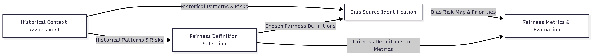

# Fairness Audit Playbook

## I. Purpose

This playbook walks you through a structured, practical **fairness audit** for your AI project. It’s designed for:

* AI developers and data scientists
* Fairness or ethics leads
* Cross-functional team members (e.g., product managers, domain experts)
* Anyone who wants to ensure their AI system is fair, accountable, and trustworthy

**What you’ll do here:** You’ll explore the history and context, define fairness in your scenario, identify potential bias points, and select measurable fairness metrics—all in a clear, actionable framework.

### Quick Links

- [Purpose](#i-purpose)
- [Why Fairness Matters](#ii-why-fairness-matters)
- [What This Notebook Helps You Achieve](iii-#what-this-notebook-helps-you-achieve)
- [Quick Relevance Check](#iv-quick-relevance-check)
- [Implementation Considerations](#v-implementation-considerations)
- [The Four Core Components](#vi-the-four-core-components)
- [How to Use This Notebook Series](#vii-how-to-use-this-notebook-series)
- [Appendix](#viii-appendix)
- [Collaboration & Feedback](#ix-collaboration--feedback)

---

## II. Why Fairness Matters

AI systems can unintentionally discriminate against protected groups, such as racial minorities, women, or the elderly, leading to real-world harms. Addressing fairness is important because:

* **Legal & Regulatory Compliance:** Prevents violations of anti-discrimination laws and avoids fines or litigation.
* **Reputation & Trust:** Fair AI builds credibility with customers, partners, and regulators.
* **Risk Mitigation:** Reduces the likelihood of biased decisions that can harm individuals or groups.
* **Business Impact:** Expands access to underserved populations and supports ethical, responsible AI practices.

---

## III. What This Notebook Helps You Achieve

* **Structured Audit:** Step-by-step guidance from historical context to metric evaluation.
* **Actionable Insights:** Identifies where bias exists and suggests how to measure it.
* **Cross-Team Collaboration:** Aligns engineering, product, and compliance teams on fairness goals.

---

## IV. Quick Relevance Check

**Use this notebook if your AI system:**

* Makes decisions affecting people (e.g., hiring, lending, healthcare, content recommendations)
* Uses personal or demographic data
* Operates in regulated industries (finance, healthcare, employment)
* Serves a diverse user population

**Skip this notebook if:**

* Your system only processes technical or operational data with no human impact
* Decisions do not affect individuals
* The system operates in a controlled, homogeneous environment

---

## V. Implementation Considerations

Before running a fairness audit or using this framework, teams should think about **resources, workflow integration, and operational readiness**.

**1. Required Resources**

* **People:** Data scientists, fairness/ethics leads, product/domain experts, optionally legal/compliance.
* **Data:** Access to representative datasets, protected attributes, and outcome labels.
* **Tools:** Python/R notebooks, visualization libraries, and statistical packages for metric computation.

**2. Workflow Integration**

* **Data Pipeline:** Ensure fairness metrics can be computed on clean, production-like data.
* **Model Lifecycle:** Integrate fairness checks into the development and review cycle, not as an afterthought.
* **Reporting:** Plan for dashboards, summaries, or automated reports that stakeholders can access.

**3. Time Investment**

* **Initial Assessment:** 2–4 weeks, depending on team size and system complexity.
* **Ongoing Monitoring:** 1–2 days per cycle.

**3. Practical Tips**

* Start small: run audits on a single model or dataset before scaling.
* Document assumptions, thresholds, and decisions for transparency.
* Schedule periodic reviews as new data or models come online.

---

## VI. The Four Core Components

Here’s what you’ll tackle and why each step matters:

1. **Historical Context Assessment**

   *What it does:* Helps you understand the historical context behind your area of work.

   *Why it matters:* Fairness depends on the situation. If you know the history and background of your area of work, be it healthcare or finance, you can judge fairness in a way that actually fits the real world, not just in theory.

   *Explore more:* [historical\__context_\_assessment.md](./1-historical-context-assessment.md)

2. **Fairness Definition Selection**

   *What it does:* Helps you pick the most fitting fairness definition (like equal opportunity or demographic parity).

   *Why it matters:* “Fairness” isn’t one-size-fits-all—you need a definition that fits your goals and context.

   *Explore more:* [fairness\_definition\_selection.md](./2-fairness-definition-selection.md)

3. **Bias Source Identification**

   *What it does:* Guides you in finding where bias might enter your system (data, model, deployment, etc.).

   *Why it matters:* Identifying these risk points helps you address bias before it causes harm.

   *Explore more:* [bias\_source\_identification.md](./3-bias-source-identification.md)

4. **Fairness Metrics & Evaluation**

   *What it does:* Helps you choose and track metrics that reflect your chosen definition of fairness.

   *Why it matters:* You can’t manage what you don’t measure, metrics make fairness visible and actionable.
   
   *Explore more:* [fairness\_metrics\_evaluation.md](./4-comprehensive-fairness-metrics.md)

Each component in this framework produces outputs that directly inform the next steps:

* **Historical Context Assessment** uncovers patterns, risks, and potential harms. These insights feed both **Fairness Definition Selection** and **Bias Source Identification**.
* **Fairness Definition Selection** determines which type(s) of fairness are most relevant. The chosen definitions guide **Bias Source Identification** and also flow directly into **Fairness Metrics & Evaluation**.
* **Bias Source Identification** produces a risk map and priority list of potential biases, which informs **Fairness Metrics & Evaluation**.
* **Fairness Metrics & Evaluation** then uses all the prior inputs — historical context, chosen fairness definitions, and bias insights — to select, compute, and interpret the appropriate metrics.

The diagram below illustrates these information flows and dependencies at a glance:

  

And to see how it works in a real case, follow along in the [**case study**](./5-case-study.md) that applies all four steps in sequence.

---

## VII. How to Use This Notebook Series

* **Go in order.** Start with the first notebook and move to the next only after completing it.
* **Take your time.** Each notebook builds on the previous so don’t rush.
* **Study the case study.** It illustrates how each component comes together in a real AI project.
* **Use the validation steps.** Every notebook includes a validation section, be sure to follow it to confirm you’ve covered everything.

---

## VIII. Appendix

Need to look up AI ethics terms like “demographic parity” or understand core AI ethics concepts? Check out the appendix here: [appendix.md](./6-appendix.md)

---

## IX. Collaboration & Feedback

We welcome collaboration and feedback from the community! If you have suggestions, improvements, or want to contribute:

- **Open an issue** to start a discussion or report a problem.
- **Fork the repository** and make your changes.
- **Open a pull request** describing your contribution.
- **Engage in code review** and respond to feedback.

All constructive feedback and contributions are appreciated. Let's work together to make fairness in AI more accessible!
