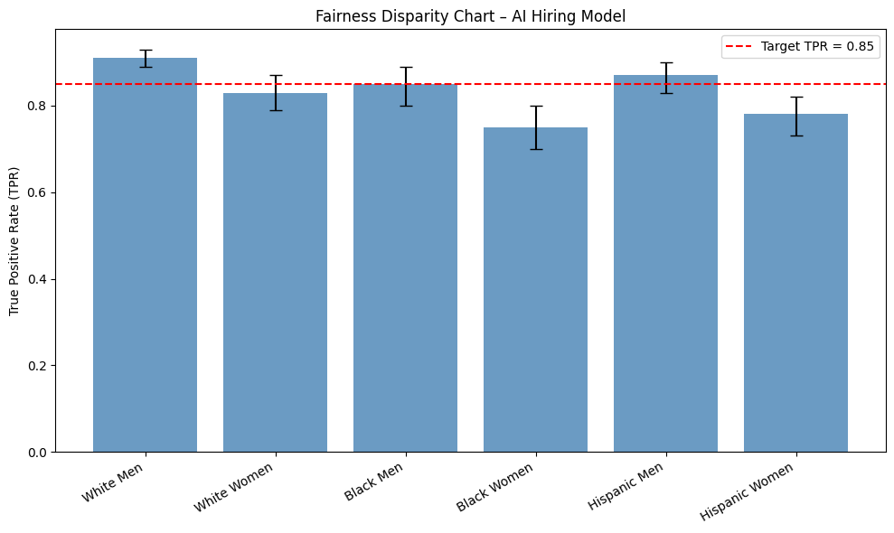

# **Case Study: Fairness Audit for an AI Hiring Platform**

This notebook walks through a complete fairness audit using the **Four-Component Framework**:

1. [Historical Context Assessment (HCA)](./1-historical-context-assessment.md)
2. [Fairness Definition Selection (FDS)](./2-fairness-definition-selection.md)
3. [Bias Source Identification (BSI)](./3-bias-source-identification.md)
4. [Comprehensive Fairness Metrics (CFM)](./4-comprehensive-fairness-metrics.md)

We’ll study an **AI hiring platform** that automatically screens software engineer candidates.

---

## **I. Historical Context Assessment (HCA)**

### **Step 1 — Domain & Application Context**

* **Domain:** Hiring / HR technology (resume screening for software engineering roles)
* **Product feature:** Model shortlists applicants for interviews by scoring resumes.
* **Directly affected:** Job applicants (especially entry-level and mid-career).
* **Indirectly affected:** HR staff (workload changes), company diversity teams, regulators, advocacy groups.

**Historical harms identified:**

* **Gender bias in hiring:** Underrepresentation of women in technical roles since the 1980s; evidence of bias in performance reviews and promotion data.
* **Racial bias in referrals:** Referral-heavy hiring pipelines favor white and affluent candidates.
* **Prestige filtering:** Overweighting of elite universities has historically excluded talented low-income or first-generation candidates.
* **Intersectional harms:** Women of color are least likely to be referred or promoted and are sparsely represented in our dataset.

**Evidence collected:**

* EEOC reports on tech workforce demographics (2015–2022)
* Academic research on gender and racial bias in performance reviews
* Public datasets on university access and socioeconomic status
* Internal HR notes on hiring practices pre-2018

---

### **Step 2 — Data & Representation Analysis**

**Data sources (with provenance):**

| Source              | Collected by             | Period    | Notes                                          |
| ------------------- | ------------------------ | --------- | ---------------------------------------------- |
| Resume database     | Internal recruiting team | 2014–2023 | Skewed toward referrals                        |
| Interview ratings   | Hiring managers          | 2016–2023 | Potential manager bias                         |
| Performance reviews | Line managers            | 2017–2023 | Qualitative → numeric conversion may distort   |
| Background checks   | Vendor data              | 2019–2023 | Limited socioeconomic context                  |

**Proxies identified:**

* **ZIP code → race / class** (historic segregation patterns).
* **University prestige → parental income / social class privilege.**
* **Job title (e.g., “assistant” vs. “lead”) → gendered career progression.**

**Data deserts (underrepresented groups):**

* Women in senior engineering roles
* Black and Hispanic graduates of non-elite universities
* Self-taught or bootcamp-trained developers, especially over age 35
* Intersectional: older Black women in technical roles almost absent

**Encoding review:**

* Categorical features like race, gender → stored as one-hot; missing data treated as “unknown,” potentially collapsing distinct cases.
  * Treating all missing data as a single “unknown” group hides differences — e.g., a person who refuses to state their gender vs. someone whose gender wasn’t recorded are both lumped together.
* Income brackets → coarse (only 3 bins), likely to obscure important variation.
  * People making $42k and $78k are treated as “the same” even though their situations differ a lot.
* Text embeddings for job history may not capture non-traditional paths well.
  * If someone has a non-traditional career path (e.g., career break for caregiving, freelance work, military service), the embedding may not represent them accurately. As these embeddings are often trained on large text datasets where “standard” job paths dominate.

---

### **Step 3 — Technology Transition & Feedback Loops**

**Previous system:** Manual resume screening by recruiters with ad hoc scoring.
**Current system:** ML model ranks resumes based on past “successful hire” profiles.
**Feedback risk:**

* If the model favors Ivy League resumes → more Ivy League hires → future data more skewed.
* If women or minority candidates are under-interviewed → less performance data → future models less accurate for these groups.
---

### V. Risk Classification Matrix

| Pattern                                      | S | L | R | Score           | Rationale                                                                 |
| -------------------------------------------- | - | - | - | --------------- | ------------------------------------------------------------------------- |
| ZIP as proxy for race                        | 3 | 3 | 3 | 9 → 🔴 Critical | ZIP present in data, known segregation patterns, used in ranking features |
| University prestige bias                     | 2 | 3 | 2 | 7 → 🟠 High     | Model heavily weights school name, limited socioeconomic diversity        |
| Sparse data for women in senior roles        | 3 | 2 | 2 | 7 → 🟠 High     | Few positive examples → model may underpredict suitability                |
| Bootcamp-trained + over 35 candidates absent | 2 | 2 | 2 | 6 → 🟠 High     | Creates unknown accuracy and potential exclusion                          |
| Manager review bias embedded in labels       | 3 | 2 | 3 | 8 → 🔴 Critical | Past ratings are ground truth → bias codified directly                    |

---

### VI. Historical Context Report (executive summary)

> **Summary:** Our hiring dataset mirrors long-standing inequities in tech recruitment, women, Black, Hispanic, and non-traditional candidates are underrepresented. Several features (ZIP, university prestige, job titles) indirectly encode race, gender, and class. If unmitigated, the AI resume screener will **amplify these biases**, giving higher scores to elite, referral-based candidates while suppressing intersectional talent (e.g., older Black women).
>
> **Top risks:**
>
> 1. ZIP code as race proxy → systemic exclusion (Score 9 🔴)
> 2. Biased manager ratings as labels → codified discrimination (Score 8 🔴)
> 3. Overweighting elite universities → socioeconomic filtering (Score 7 🟠)
>
> **Next actions:**
>
> * Exclude or debias ZIP feature before model training.
> * Reweight or audit labels to remove performance review bias.
> * Collect targeted data for underrepresented groups (bootcamp grads, senior women engineers).
> * Define fairness metrics focusing on intersectional groups (e.g., recall parity for women of color).

---

## **II. Fairness Definition Selection (FDS)** <a id="fds"></a>

The purpose of this step is to define which fairness definition(s) best fit the **hiring platform’s context, harms, and stakeholder priorities**, and document trade-offs transparently. This step outputs a **Fairness Definition Report** that guides bias testing and model evaluation.

---

### **Step 0 — Stakeholder Mapping**

Before choosing fairness definitions, it’s essential to understand **who is affected** by the hiring platform and **what each group values most**.

**Key Stakeholders & Priorities:**

* **Job Applicants** — Want fair access to opportunities and to avoid being overlooked due to demographic or educational background.
* **Recruiters / Hiring Managers** — Need qualified candidates surfaced efficiently while maintaining confidence in recommendations.
* **Company Leadership** — Aims to meet diversity goals, maintain reputation, and avoid legal/regulatory exposure.
* **Regulators / Legal Teams** — Ensure compliance with equal employment and anti-discrimination laws.
* **Engineering / Product Teams** — Want fairness criteria that are technically feasible, measurable, and do not overly degrade performance.

**Tensions to note:**

* **Applicants vs. recruiters:** Applicants want maximal inclusion, while recruiters want efficient filtering.
* **Leadership vs. product constraints:** Leadership may want ambitious fairness goals that require new technical capabilities.
* **Compliance vs. speed:** Legal teams may want rigorous documentation that slows deployment.

---

### **Step 1 — Use the Decision Tree**

#### **1. Historical Context**

*Is there a known history of systematic exclusion?*

→ **Yes**: Women, Black candidates, and bootcamp graduates have historically been excluded.

→ **Demographic Parity** should be **monitored**, even if not enforced directly.

#### **2. Error Sensitivity Analysis**

*Which type of error causes more harm?*

→ **False negatives are worse**: Missing qualified candidates harms individuals and company diversity.

→ **Equal Opportunity** should be **prioritized**.

#### **3. Score Visibility**

*Are probabilistic scores shown to end-users?*

→ **No**: Scores are only used internally by recruiters.

→ **Predictive Parity** less critical.

#### **4. Individual Impact**

*Does fairness at the individual level matter more than group stats?*

→ **Yes**: Two nearly identical candidates should receive similar recommendations.

→ **Individual Fairness** should be **considered**.

---

### **Step 2 — Select Definitions**

**Primary fairness goal:** **Equal Opportunity**

* Ensures qualified candidates from all groups have the same chance of being shortlisted.
* Addresses historical exclusion without requiring strict quota outcomes.

**Secondary metrics to monitor:**

* **Demographic Parity:** Track if interview rates differ significantly by gender, race, or education background.
* **Individual Fairness:** Validate that similar resumes receive consistent scores.

---

### **Step 3 — Document Trade-Offs**

```markdown
**Selected Fairness Definition(s):**  
- Equal Opportunity (primary)  
- Demographic Parity (monitoring)  
- Individual Fairness (monitoring)  

**Why Chosen:**  
- Historical bias shows qualified women and Black candidates often overlooked  
- Stakeholders prioritize reducing false negatives over strict demographic quotas  
- Consistency for similar applicants matters for legal defensibility and trust  

**Trade-Offs Acknowledged:**  
- May not achieve full demographic parity due to pipeline differences  
- Slight performance loss if more borderline candidates are interviewed  
- Requires building a resume similarity metric for individual fairness testing  

**Monitoring Plan:**  
- Primary Metric: Equal Opportunity across gender and race  
- Secondary Metrics: Demographic parity, resume similarity checks  
- Frequency: Quarterly fairness review with compliance + recruiting teams  
```

---

### **Step 4 — Examples of When to Apply These Definitions**

* **Equal Opportunity:** Use when *qualified people* are being excluded (e.g., past hiring bias, admissions filters).
* **Demographic Parity:** Use when *outcomes* must be balanced (e.g., outreach programs, government quotas).
* **Individual Fairness:** Use when *consistency* matters (e.g., resume-screening tools, loan approvals).

---

### **Fairness Definition Report (summary)**

> **Summary:** We selected **Equal Opportunity** as the primary fairness definition to ensure qualified candidates from historically excluded groups are not overlooked. **Demographic Parity** and **Individual Fairness** will be monitored to track representation and consistency. Trade-offs (accuracy vs. diversity) will be explicitly documented and reviewed quarterly.
>
> **Next actions:**
> * Secure sign-off from all key stakeholders on fairness priorities.
> * Document and revisit trade-offs quarterly to ensure alignment with evolving goals.

## **III. Bias Source Identification (BSI)** <a id="bsi"></a>

This step pinpoints where bias enters the AI hiring platform, records how we detected it, then ranks each issue to guide remediation.

---

### **1. Detected Bias Sources**

Biases were identified using:

* **Historical Context Assessment (HCA)** → Found structural exclusion patterns.
* **Dataset Demographic Audit** → Flagged underrepresentation and data deserts.
* **Feature Proxy Audit** → Located variables encoding sensitive information.
* **Label Quality Review** → Exposed subjective performance ratings.
* **Validation Coverage Check** → Compared test data vs. deployment population.
* **User Flow Review** → Observed recruiter interactions with model outputs.

**Findings:**

1. **ZIP code as race proxy** (feature encodes segregation patterns)
2. **University prestige overweighted** (socioeconomic privilege baked into model)
3. **Sparse data for women in senior roles** (high false-negative risk)
4. **Performance review label bias** (manager subjectivity influencing ground truth)
5. **Validation set missing bootcamp grads** (non-traditional paths unseen during eval)
6. **Recruiter overreliance on scores** (deployment risk of rubber-stamping AI output)

---

### **2. Prioritization Matrix**

| Bias Source                           | Evidence from Audits                     | Sev. | Scope | Persist. | Hist. Align. | Feasib. | Avg | Priority | Owner          |
| ------------------------------------- | ---------------------------------------- | ---- | ----- | -------- | ------------ | ------- | --- | -------- | -------------- |
| ZIP code as race proxy                | Proxy audit + HCA                        | 4    | 3     | 4        | 4            | 3       | 3.6 | High     | Data Eng       |
| University prestige overweighted      | Feature weights + demographic audit      | 3    | 4     | 4        | 3            | 3       | 3.4 | High     | Feature Eng    |
| Sparse data for women in senior roles | Dataset audit + error disaggregation     | 4    | 3     | 3        | 4            | 2       | 3.2 | High     | Data Science   |
| Performance review label bias         | Label audit + HCA                        | 3    | 4     | 3        | 3            | 2       | 3.0 | Medium   | ML Eng         |
| Validation set missing bootcamp grads | Validation audit                         | 2    | 2     | 4        | 3            | 4       | 3.0 | Medium   | QA / Eval Team |
| Recruiter overreliance on scores      | Deployment audit (user flow observation) | 3    | 5     | 3        | 2            | 3       | 3.2 | High     | Product / Ops  |

---

### **3. Remediation Plans**

For every **High priority bias**, we documented and tracked remediation:

**ZIP code as race proxy**

* **Evidence:** Proxy audit shows ZIP code strongly correlates with race; still used in features.
* **Impact:** Disadvantages candidates from segregated areas despite qualifications.
* **Remediation:**

  * Quick: Remove ZIP entirely from inputs.
  * Long-term: Replace with region-level labor stats that are less granular.
* **Owner / Deadline:** Data Eng – Q2 release.
* **Links:** HCA Step 3, FDS metric (Equal Opportunity).

---

**University prestige overweighted**

* **Evidence:** Feature weight audit revealed heavy reliance on school ranking, overemphasizing elite institutions.
* **Impact:** Candidates from less prestigious schools (including first-generation and low-income students) are unfairly penalized.
* **Remediation:**

  * Quick: Cap or normalize feature contribution from school ranking.
  * Long-term: Replace with skill-based features (e.g., coding assessments, project portfolios) to evaluate ability directly.
* **Owner / Deadline:** Feature Eng – Q2 release.
* **Links:** HCA Step 2, FDS metric (Equal Opportunity).

---

**Sparse data for women in senior roles**

* **Evidence:** Dataset audit found low counts → model underperforms on this slice.
* **Impact:** Higher false negatives for qualified senior women.
* **Remediation:**

  * Quick: Use data augmentation / class weighting.
  * Long-term: Targeted data collection or synthetic resume generation with review.
* **Owner / Deadline:** Data Science – Q3 release.
* **Links:** HCA Step 4, CFM monitoring plan.

## **Bias Source Identification (executive summary)**

> **Summary:** We identified **six major bias sources** using audits of data, features, labels, validation coverage, and recruiter behavior. If unaddressed, these will amplify structural exclusion in tech hiring and undermine fairness goals.
> 
> **Next actions:**
> * Remove or replace ZIP as a feature before training.
> * Cap or normalize university prestige weights; shift to skill-based features.
> * Augment data or rebalance model for women in senior roles; validate with disaggregated metrics.
---

## **IV. Comprehensive Fairness Metrics (CFM)** <a id="cfm"></a>

The purpose of this step is to **quantify fairness** using metrics that match the definitions selected in the FDS step and to validate whether remediation efforts (from BSI) are effective. This step outputs a **Fairness Metrics Report** with concrete evidence and recommendations.

---

### **1. Metric Selection**

Based on the **FDS step**, the primary fairness goal is **Equal Opportunity**, with **Demographic Parity** and **Individual Fairness** tracked as secondary metrics.

* **Problem Type:** Classification (resume → shortlist/not shortlist)
* **Selected Fairness Definitions:** Equal Opportunity (primary), Demographic Parity (monitoring), Individual Fairness (monitoring)
* **Chosen Metrics:**

  * **TPR Difference** (gap in true positive rate between groups) → *measures Equal Opportunity*
  * **Demographic Parity Difference** → *monitors selection rates*
  * **Consistency Score** → *checks similar resumes are scored consistently*

---

### **2. Metric Computation**

**Example: True Positive Rate (TPR) Difference**

* Suppose:

  * Women: 80 out of 100 qualified candidates shortlisted → TPR = 0.80
  * Men: 90 out of 100 qualified candidates shortlisted → TPR = 0.90
* **TPR Difference = 0.90 – 0.80 = 0.10 (10 percentage points)**
* *Interpretation:* The model is less likely to shortlist qualified women by 10 p.p.

**Example: Demographic Parity Difference**

* Suppose:

  * Women: 120 out of 300 total applicants shortlisted → Selection Rate = 0.40
  * Men: 240 out of 500 total applicants shortlisted → Selection Rate = 0.48
* **Demographic Parity Difference = 0.48 – 0.40 = 0.08 (8 p.p.)**
* *Interpretation:* Shortlisting rates differ by 8 p.p., even before conditioning on qualifications.

**Example: Consistency Score**

* Select pairs of resumes that are highly similar in skills/experience.
* Compute the average absolute difference in their model scores.
* **Lower is better → indicates more consistent treatment.**

---

### **3. Statistical Validation (Worked Example)**

The audit team measured **True Positive Rate (TPR) differences** between groups, using *Equal Opportunity* as the primary fairness goal. To verify whether disparities are real or just noise:

#### **Bootstrap Confidence Intervals (for stable metrics)**

* **Groups tested (Gender × Race):**

  * White Men, White Women, Black Men, Black Women, Hispanic Men, Hispanic Women.
* **True Positive Rate estimates (qualified candidates correctly shortlisted):**

| Group          | TPR  | 95% CI        |
| -------------- | ---- | ------------- |
| White Men      | 0.91 | \[0.89, 0.93] |
| White Women    | 0.83 | \[0.79, 0.87] |
| Black Men      | 0.85 | \[0.80, 0.89] |
| Black Women    | 0.75 | \[0.70, 0.80] |
| Hispanic Men   | 0.87 | \[0.83, 0.90] |
| Hispanic Women | 0.78 | \[0.73, 0.82] |

* **Largest gap:** White Men (0.91) vs. Black Women (0.75) → **0.16 disparity**.
* **CI widths are narrow (±0.03–0.04)** → these gaps are **stable**, not random noise.

#### **Bayesian Estimation (for small subgroups)**

If *Black Women* had only \~80 samples, a Bayesian approach would add a weak prior (e.g. “assume no massive gap unless data supports it”) to avoid overreacting to small fluctuations. The **posterior credible interval** might be:

* Black Women TPR = 0.75 with 95% CrI \[0.68, 0.82].
* Interpretation is the same — *even the most optimistic bound (0.82) is still well below the 0.91 baseline*.

---

### **4. Visualization and Reporting**

The team prepared **visuals for both engineers and non-technical reviewers**:

#### **A. Fairness Disparity Chart**

A bar chart showing **TPR per group** with **error bars for CI**, and a **policy line at 0.85** (target minimum TPR).

<p align="center">
  
</p>

**Interpretation:**

> *Qualified Black women have a TPR of 0.75 vs. 0.91 for white men — a 16 p.p. gap. Since our minimum target TPR is 0.85, this is a **critical disparity** requiring remediation.*

---

#### **B. Intersectional Heatmap**

This visual combines **gender × race** TPR differences, using **color intensity for disparity** and **annotations for group size**.

<p align="center">
  
</p>

**Interpretation:**

> *The heatmap shows **compounded disadvantage for Black and Hispanic women**, who have the lowest TPRs. These disparities are not explained by small sample size and persist after statistical validation.*


---

### **5. Fairness Metrics Report (summary)**

> Here’s your summary rewritten in the **structured style** of the earlier Historical Context and Bias Source Identification reports:

---

### **5. Fairness Metrics Report (executive summary)**

> **Summary:** The hiring model was audited using **Equal Opportunity** as the primary fairness goal. Analysis focused on **True Positive Rate (TPR)** differences across gender and racial groups, supplemented with demographic parity and consistency checks.
> 
> **Top findings:**
> 
> * Qualified women have a **10 percentage point lower TPR** than men.
> * Intersectional analysis shows **Black and Hispanic women face the largest disadvantage (TPR ≈ 0.75 vs. 0.91 for white men).**
> * **Confidence intervals are narrow**, confirming disparities are statistically significant rather than noise.
> 
> **Next actions:**
> 
> * **Reweight features and training labels** to reduce bias in candidate scoring.
> * **Augment training data** for underrepresented groups (women of color, career-switchers).
> * **Reaudit quarterly** using the Fairness Metrics Tool with updated model outputs.
> * **Track secondary metrics** (demographic parity, individual consistency) to ensure balanced progress.
