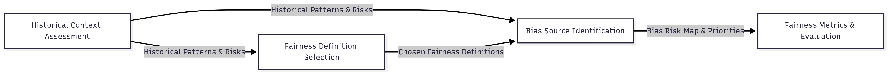

## Purpose of This Notebook

This notebook walks you through a structured, thoughtful fairness audit for your AI project. It’s designed to be used by:

* AI developers and data scientists
* Fairness or ethics leads
* Cross-functional team members (e.g., product managers, domain experts)
* Anyone who wants to ensure their AI system is fair and accountable

**What you’re doing here**: You’ll explore the history and context, define fairness in your scenario, identify possible bias points, and choose ways to measure fairness—all in a clear and practical way.

---

## The Four Core Components

Here’s what you’ll tackle and why each step matters:

1. **Historical Context Assessment**

   *What it does:* Helps you understand the historical context behind your area of work.

   *Why it matters:* Fairness depends on the situation. If you know the history and background of your area of work, be it healthcare or finance, you can judge fairness in a way that actually fits the real world, not just in theory.

   *Explore more:* [historical\__context_\_assessment.md](./1-historical-context-assessment.md)

2. **Fairness Definition Selection**

   *What it does:* Helps you pick the most fitting fairness definition (like equal opportunity or demographic parity).

   *Why it matters:* “Fairness” isn’t one-size-fits-all—you need a definition that fits your goals and context.

   *Explore more:* [fairness\_definition\_selection.md](./2-fairness-definition-selection.md)

3. **Bias Source Identification**

   *What it does:* Guides you in finding where bias might enter your system (data, model, deployment, etc.).

   *Why it matters:* Identifying these risk points helps you address bias before it causes harm.

   *Explore more:* [bias\_source\_identification.md](./3-bias-source-identification.md)

4. **Fairness Metrics & Evaluation**

   *What it does:* Helps you choose and track metrics that reflect your chosen definition of fairness.

   *Why it matters:* You can’t manage what you don’t measure, metrics make fairness visible and actionable.
   
   *Explore more:* [fairness\_metrics\_evaluation.md](./4-comprehensive-fairness-metrics.md)

Each component in this framework produces concrete outputs that feed directly into the next stage. Historical context assessment uncovers risks that guide fairness choices. These fairness choices inform how we search for bias. Finally, bias insights define which metrics we track and how we evaluate progress. The diagram below shows these information flows at a glance.

  

And to see how it works in a real case, follow along in the [**case study**](./5-case-study.md) that applies all four steps in sequence.

---

## How to Use This Notebook Series

* **Go in order.** Start with the first notebook and move to the next only after completing it.
* **Take your time.** Each notebook builds on the previous so don’t rush.
* **Study the case study.** It illustrates how each component comes together in a real AI project.
* **Use the validation steps.** Every notebook includes a validation section, be sure to follow it to confirm you’ve covered everything.

---

## Glossary

Need to look up AI ethics terms like “demographic parity” or “intersectionality”? Check out the glossary here: [glossary.md](./6-glossary.md)
